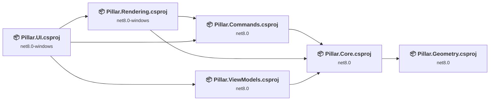
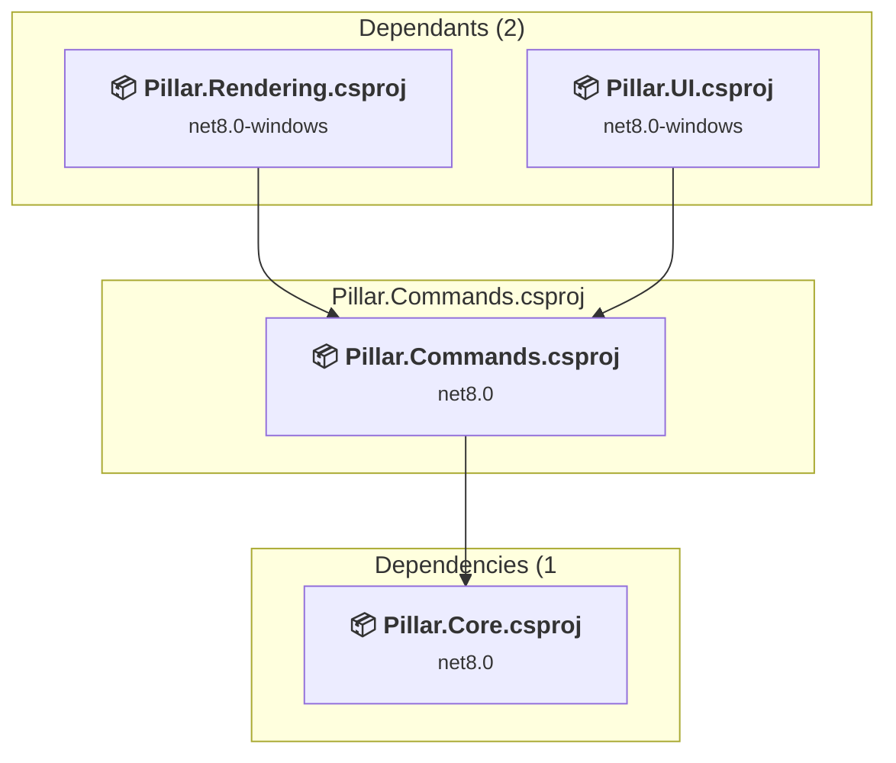
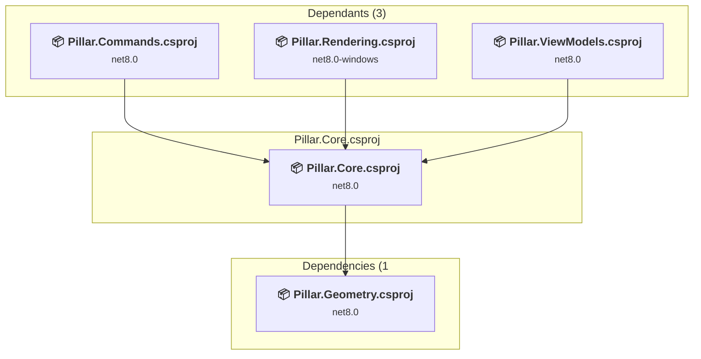
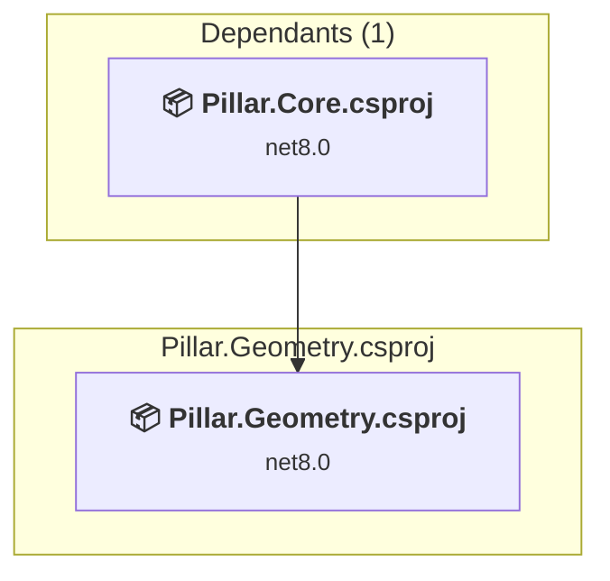
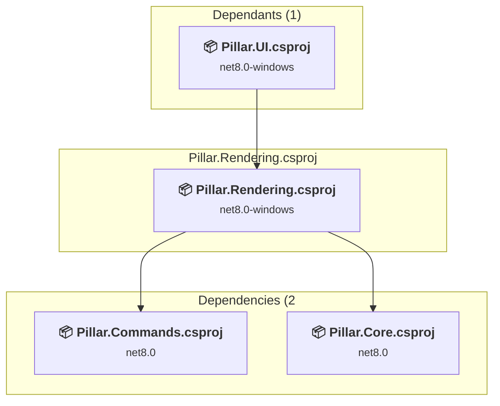
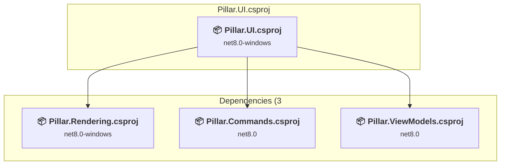
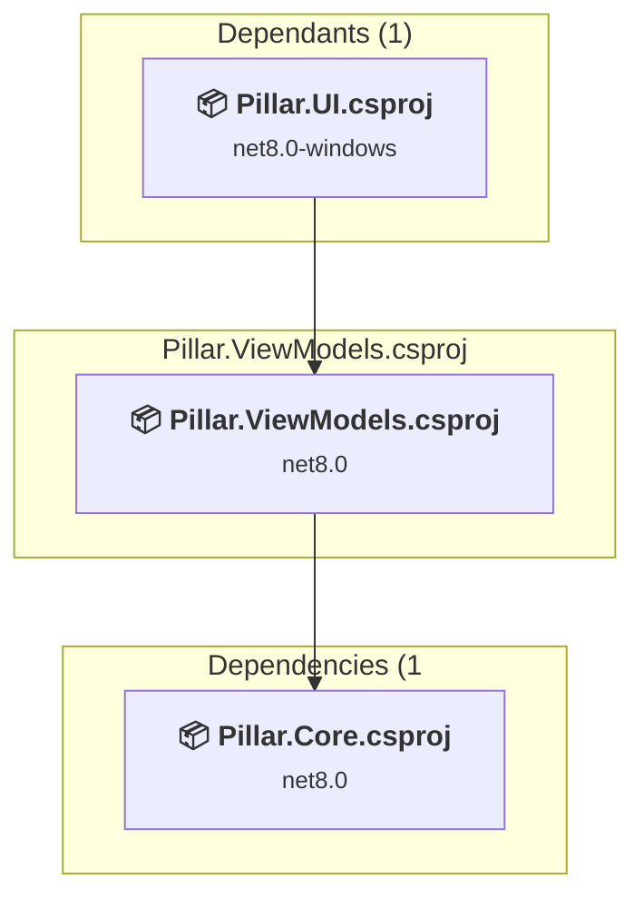

# Projects and dependencies analysis

This document provides a comprehensive overview of the projects and their dependencies in the context of upgrading to .NETCoreApp,Version=v10.0.

## Table of Contents

- [Executive Summary](#executive-Summary)
  - [Highlevel Metrics](#highlevel-metrics)
  - [Projects Compatibility](#projects-compatibility)
  - [Package Compatibility](#package-compatibility)
  - [API Compatibility](#api-compatibility)
- [Aggregate NuGet packages details](#aggregate-nuget-packages-details)
- [Top API Migration Challenges](#top-api-migration-challenges)
  - [Technologies and Features](#technologies-and-features)
  - [Most Frequent API Issues](#most-frequent-api-issues)
- [Projects Relationship Graph](#projects-relationship-graph)
- [Project Details](#project-details)

  - [src\Pillar.Commands\Pillar.Commands.csproj](#srcpillarcommandspillarcommandscsproj)
  - [src\Pillar.Core\Pillar.Core.csproj](#srcpillarcorepillarcorecsproj)
  - [src\Pillar.Geometry\Pillar.Geometry.csproj](#srcpillargeometrypillargeometrycsproj)
  - [src\Pillar.Rendering\Pillar.Rendering.csproj](#srcpillarrenderingpillarrenderingcsproj)
  - [src\Pillar.UI\Pillar.UI.csproj](#srcpillaruipillaruicsproj)
  - [src\Pillar.ViewModels\Pillar.ViewModels.csproj](#srcpillarviewmodelspillarviewmodelscsproj)

## Executive Summary

### Highlevel Metrics

| Metric | Count | Status |
| :--- | :---: | :--- |
| Total Projects | 6 | All require upgrade |
| Total NuGet Packages | 2 | 1 need upgrade |
| Total Code Files | 41 |  |
| Total Code Files with Incidents | 23 |  |
| Total Lines of Code | 4405 |  |
| Total Number of Issues | 539 |  |
| Estimated LOC to modify | 531+ | at least 12.1% of codebase |

### Projects Compatibility

| Project | Target Framework | Difficulty | Package Issues | API Issues | Est. LOC Impact | Description |
| :--- | :---: | :---: | :---: | :---: | :---: | :--- |
| [src\Pillar.Commands\Pillar.Commands.csproj](#srcpillarcommandspillarcommandscsproj) | net8.0 | 🟢 Low | 0 | 0 |  | ClassLibrary, Sdk Style = True |
| [src\Pillar.Core\Pillar.Core.csproj](#srcpillarcorepillarcorecsproj) | net8.0 | 🟢 Low | 0 | 0 |  | ClassLibrary, Sdk Style = True |
| [src\Pillar.Geometry\Pillar.Geometry.csproj](#srcpillargeometrypillargeometrycsproj) | net8.0 | 🟢 Low | 0 | 0 |  | ClassLibrary, Sdk Style = True |
| [src\Pillar.Rendering\Pillar.Rendering.csproj](#srcpillarrenderingpillarrenderingcsproj) | net8.0-windows | 🟡 Medium | 1 | 193 | 193+ | Wpf, Sdk Style = True |
| [src\Pillar.UI\Pillar.UI.csproj](#srcpillaruipillaruicsproj) | net8.0-windows | 🟡 Medium | 1 | 338 | 338+ | Wpf, Sdk Style = True |
| [src\Pillar.ViewModels\Pillar.ViewModels.csproj](#srcpillarviewmodelspillarviewmodelscsproj) | net8.0 | 🟢 Low | 0 | 0 |  | ClassLibrary, Sdk Style = True |

### Package Compatibility

| Status | Count | Percentage |
| :--- | :---: | :---: |
| ✅ Compatible | 1 | 50.0% |
| ⚠️ Incompatible | 1 | 50.0% |
| 🔄 Upgrade Recommended | 0 | 0.0% |
| ***Total NuGet Packages*** | ***2*** | ***100%*** |

### API Compatibility

| Category | Count | Impact |
| :--- | :---: | :--- |
| 🔴 Binary Incompatible | 523 | High - Require code changes |
| 🟡 Source Incompatible | 3 | Medium - Needs re-compilation and potential conflicting API error fixing |
| 🔵 Behavioral change | 5 | Low - Behavioral changes that may require testing at runtime |
| ✅ Compatible | 3483 |  |
| ***Total APIs Analyzed*** | ***4014*** |  |

## Aggregate NuGet packages details

| Package | Current Version | Suggested Version | Projects | Description |
| :--- | :---: | :---: | :--- | :--- |
| CommunityToolkit.Mvvm | 8.2.2 |  | [Pillar.ViewModels.csproj](#srcpillarviewmodelspillarviewmodelscsproj) | ✅Compatible |
| HelixToolkit.Wpf.SharpDX | 3.1.2 |  | [Pillar.Rendering.csproj](#srcpillarrenderingpillarrenderingcsproj) [Pillar.UI.csproj](#srcpillaruipillaruicsproj) | ⚠️NuGet package is incompatible |

## Top API Migration Challenges

### Technologies and Features

| Technology | Issues | Percentage | Migration Path |
| :--- | :---: | :---: | :--- |
| WPF (Windows Presentation Foundation) | 200 | 37.7% | WPF APIs for building Windows desktop applications with XAML-based UI that are available in .NET on Windows. WPF provides rich desktop UI capabilities with data binding and styling. Enable Windows Desktop support: Option 1 (Recommended): Target net9.0-windows; Option 2: Add <UseWindowsDesktop>true</UseWindowsDesktop>. |
| Legacy Configuration System | 3 | 0.6% | Legacy XML-based configuration system (app.config/web.config) that has been replaced by a more flexible configuration model in .NET Core. The old system was rigid and XML-based. Migrate to Microsoft.Extensions.Configuration with JSON/environment variables; use System.Configuration.ConfigurationManager NuGet package as interim bridge if needed. |

### Most Frequent API Issues

| API | Count | Percentage | Category |
| :--- | :---: | :---: | :--- |
| T:System.Windows.Visibility | 39 | 7.3% | Binary Incompatible |
| T:System.Windows.Media.Color | 25 | 4.7% | Binary Incompatible |
| T:System.Windows.Point | 24 | 4.5% | Binary Incompatible |
| T:System.Windows.Media.DoubleCollection | 19 | 3.6% | Binary Incompatible |
| T:System.Windows.RoutedEventHandler | 18 | 3.4% | Binary Incompatible |
| T:System.Windows.Shapes.Rectangle | 16 | 3.0% | Binary Incompatible |
| T:System.Windows.Input.ModifierKeys | 15 | 2.8% | Binary Incompatible |
| T:System.Windows.Rect | 13 | 2.4% | Binary Incompatible |
| T:System.Windows.Window | 13 | 2.4% | Binary Incompatible |
| P:System.Windows.Point.Y | 12 | 2.3% | Binary Incompatible |
| P:System.Windows.Point.X | 12 | 2.3% | Binary Incompatible |
| T:System.Windows.MessageBoxImage | 12 | 2.3% | Binary Incompatible |
| T:System.Windows.MessageBoxButton | 12 | 2.3% | Binary Incompatible |
| T:System.Windows.MessageBoxResult | 12 | 2.3% | Binary Incompatible |
| T:System.Windows.Input.Key | 12 | 2.3% | Binary Incompatible |
| T:System.Windows.RoutedEventArgs | 9 | 1.7% | Binary Incompatible |
| T:System.Windows.Controls.Button | 8 | 1.5% | Binary Incompatible |
| M:System.Windows.Point.#ctor(System.Double,System.Double) | 7 | 1.3% | Binary Incompatible |
| M:System.Windows.Media.Color.FromRgb(System.Byte,System.Byte,System.Byte) | 7 | 1.3% | Binary Incompatible |
| P:System.Windows.RoutedEventArgs.Handled | 7 | 1.3% | Binary Incompatible |
| F:System.Windows.Visibility.Visible | 6 | 1.1% | Binary Incompatible |
| T:System.Windows.MessageBox | 6 | 1.1% | Binary Incompatible |
| M:System.Windows.MessageBox.Show(System.Windows.Window,System.String,System.String,System.Windows.MessageBoxButton,System.Windows.MessageBoxImage) | 6 | 1.1% | Binary Incompatible |
| P:Microsoft.Win32.FileDialog.FileName | 6 | 1.1% | Binary Incompatible |
| T:System.Windows.Input.MouseButton | 6 | 1.1% | Binary Incompatible |
| T:System.Windows.Input.Keyboard | 5 | 0.9% | Binary Incompatible |
| E:System.Windows.Controls.Primitives.ButtonBase.Click | 5 | 0.9% | Binary Incompatible |
| T:System.Windows.DependencyObject | 5 | 0.9% | Binary Incompatible |
| F:System.Windows.Input.ModifierKeys.Control | 4 | 0.8% | Binary Incompatible |
| M:System.Windows.Rect.Contains(System.Windows.Point) | 4 | 0.8% | Binary Incompatible |
| F:System.Windows.Visibility.Collapsed | 4 | 0.8% | Binary Incompatible |
| T:System.Windows.Controls.Canvas | 4 | 0.8% | Binary Incompatible |
| M:System.Windows.Media.DoubleCollection.Add(System.Double) | 4 | 0.8% | Binary Incompatible |
| M:System.Windows.Media.DoubleCollection.#ctor | 4 | 0.8% | Binary Incompatible |
| F:System.Windows.MessageBoxButton.OK | 4 | 0.8% | Binary Incompatible |
| T:System.Windows.Controls.TextBox | 4 | 0.8% | Binary Incompatible |
| T:System.Windows.Input.KeyEventHandler | 4 | 0.8% | Binary Incompatible |
| T:System.Windows.Input.MouseButtonEventHandler | 4 | 0.8% | Binary Incompatible |
| F:System.Windows.Visibility.Hidden | 3 | 0.6% | Binary Incompatible |
| P:System.Windows.FrameworkContentElement.Name | 3 | 0.6% | Binary Incompatible |
| P:System.Windows.Input.Keyboard.Modifiers | 3 | 0.6% | Binary Incompatible |
| P:System.Windows.Rect.Left | 3 | 0.6% | Binary Incompatible |
| P:System.Windows.Rect.Top | 3 | 0.6% | Binary Incompatible |
| T:System.Windows.FrameworkElement | 3 | 0.6% | Binary Incompatible |
| F:System.Windows.MessageBoxImage.Error | 3 | 0.6% | Binary Incompatible |
| M:Microsoft.Win32.CommonDialog.ShowDialog(System.Windows.Window) | 3 | 0.6% | Binary Incompatible |
| P:Microsoft.Win32.FileDialog.Filter | 3 | 0.6% | Binary Incompatible |
| P:Microsoft.Win32.CommonItemDialog.Title | 3 | 0.6% | Binary Incompatible |
| T:System.Uri | 3 | 0.6% | Behavioral Change |
| E:System.Windows.Controls.MenuItem.Click | 3 | 0.6% | Binary Incompatible |

## Projects Relationship Graph

Legend:
📦 SDK-style project
⚙️ Classic project

## Project Details

### src\Pillar.Commands\Pillar.Commands.csproj

#### Project Info

- **Current Target Framework:** net8.0
- **Proposed Target Framework:** net10.0
- **SDK-style**: True
- **Project Kind:** ClassLibrary
- **Dependencies**: 1
- **Dependants**: 2
- **Number of Files**: 4
- **Number of Files with Incidents**: 1
- **Lines of Code**: 298
- **Estimated LOC to modify**: 0+ (at least 0.0% of the project)

#### Dependency Graph

Legend:
📦 SDK-style project
⚙️ Classic project

### API Compatibility

| Category | Count | Impact |
| :--- | :---: | :--- |
| 🔴 Binary Incompatible | 0 | High - Require code changes |
| 🟡 Source Incompatible | 0 | Medium - Needs re-compilation and potential conflicting API error fixing |
| 🔵 Behavioral change | 0 | Low - Behavioral changes that may require testing at runtime |
| ✅ Compatible | 192 |  |
| ***Total APIs Analyzed*** | ***192*** |  |

### src\Pillar.Core\Pillar.Core.csproj

#### Project Info

- **Current Target Framework:** net8.0
- **Proposed Target Framework:** net10.0
- **SDK-style**: True
- **Project Kind:** ClassLibrary
- **Dependencies**: 1
- **Dependants**: 3
- **Number of Files**: 18
- **Number of Files with Incidents**: 1
- **Lines of Code**: 1479
- **Estimated LOC to modify**: 0+ (at least 0.0% of the project)

#### Dependency Graph

Legend:
📦 SDK-style project
⚙️ Classic project

### API Compatibility

| Category | Count | Impact |
| :--- | :---: | :--- |
| 🔴 Binary Incompatible | 0 | High - Require code changes |
| 🟡 Source Incompatible | 0 | Medium - Needs re-compilation and potential conflicting API error fixing |
| 🔵 Behavioral change | 0 | Low - Behavioral changes that may require testing at runtime |
| ✅ Compatible | 1092 |  |
| ***Total APIs Analyzed*** | ***1092*** |  |

### src\Pillar.Geometry\Pillar.Geometry.csproj

#### Project Info

- **Current Target Framework:** net8.0
- **Proposed Target Framework:** net10.0
- **SDK-style**: True
- **Project Kind:** ClassLibrary
- **Dependencies**: 0
- **Dependants**: 1
- **Number of Files**: 1
- **Number of Files with Incidents**: 1
- **Lines of Code**: 9
- **Estimated LOC to modify**: 0+ (at least 0.0% of the project)

#### Dependency Graph

Legend:
📦 SDK-style project
⚙️ Classic project

### API Compatibility

| Category | Count | Impact |
| :--- | :---: | :--- |
| 🔴 Binary Incompatible | 0 | High - Require code changes |
| 🟡 Source Incompatible | 0 | Medium - Needs re-compilation and potential conflicting API error fixing |
| 🔵 Behavioral change | 0 | Low - Behavioral changes that may require testing at runtime |
| ✅ Compatible | 2 |  |
| ***Total APIs Analyzed*** | ***2*** |  |

### src\Pillar.Rendering\Pillar.Rendering.csproj

#### Project Info

- **Current Target Framework:** net8.0-windows
- **Proposed Target Framework:** net10.0-windows
- **SDK-style**: True
- **Project Kind:** Wpf
- **Dependencies**: 2
- **Dependants**: 1
- **Number of Files**: 11
- **Number of Files with Incidents**: 11
- **Lines of Code**: 1543
- **Estimated LOC to modify**: 193+ (at least 12.5% of the project)

#### Dependency Graph

Legend:
📦 SDK-style project
⚙️ Classic project

### API Compatibility

| Category | Count | Impact |
| :--- | :---: | :--- |
| 🔴 Binary Incompatible | 193 | High - Require code changes |
| 🟡 Source Incompatible | 0 | Medium - Needs re-compilation and potential conflicting API error fixing |
| 🔵 Behavioral change | 0 | Low - Behavioral changes that may require testing at runtime |
| ✅ Compatible | 1309 |  |
| ***Total APIs Analyzed*** | ***1502*** |  |

#### Project Technologies and Features

| Technology | Issues | Percentage | Migration Path |
| :--- | :---: | :---: | :--- |
| WPF (Windows Presentation Foundation) | 59 | 30.6% | WPF APIs for building Windows desktop applications with XAML-based UI that are available in .NET on Windows. WPF provides rich desktop UI capabilities with data binding and styling. Enable Windows Desktop support: Option 1 (Recommended): Target net9.0-windows; Option 2: Add <UseWindowsDesktop>true</UseWindowsDesktop>. |

### src\Pillar.UI\Pillar.UI.csproj

#### Project Info

- **Current Target Framework:** net8.0-windows
- **Proposed Target Framework:** net10.0-windows
- **SDK-style**: True
- **Project Kind:** Wpf
- **Dependencies**: 3
- **Dependants**: 0
- **Number of Files**: 6
- **Number of Files with Incidents**: 8
- **Lines of Code**: 973
- **Estimated LOC to modify**: 338+ (at least 34.7% of the project)

#### Dependency Graph

Legend:
📦 SDK-style project
⚙️ Classic project

### API Compatibility

| Category | Count | Impact |
| :--- | :---: | :--- |
| 🔴 Binary Incompatible | 330 | High - Require code changes |
| 🟡 Source Incompatible | 3 | Medium - Needs re-compilation and potential conflicting API error fixing |
| 🔵 Behavioral change | 5 | Low - Behavioral changes that may require testing at runtime |
| ✅ Compatible | 586 |  |
| ***Total APIs Analyzed*** | ***924*** |  |

#### Project Technologies and Features

| Technology | Issues | Percentage | Migration Path |
| :--- | :---: | :---: | :--- |
| Legacy Configuration System | 3 | 0.9% | Legacy XML-based configuration system (app.config/web.config) that has been replaced by a more flexible configuration model in .NET Core. The old system was rigid and XML-based. Migrate to Microsoft.Extensions.Configuration with JSON/environment variables; use System.Configuration.ConfigurationManager NuGet package as interim bridge if needed. |
| WPF (Windows Presentation Foundation) | 141 | 41.7% | WPF APIs for building Windows desktop applications with XAML-based UI that are available in .NET on Windows. WPF provides rich desktop UI capabilities with data binding and styling. Enable Windows Desktop support: Option 1 (Recommended): Target net9.0-windows; Option 2: Add <UseWindowsDesktop>true</UseWindowsDesktop>. |

### src\Pillar.ViewModels\Pillar.ViewModels.csproj

#### Project Info

- **Current Target Framework:** net8.0
- **Proposed Target Framework:** net10.0
- **SDK-style**: True
- **Project Kind:** ClassLibrary
- **Dependencies**: 1
- **Dependants**: 1
- **Number of Files**: 1
- **Number of Files with Incidents**: 1
- **Lines of Code**: 103
- **Estimated LOC to modify**: 0+ (at least 0.0% of the project)

#### Dependency Graph

Legend:
📦 SDK-style project
⚙️ Classic project

### API Compatibility

| Category | Count | Impact |
| :--- | :---: | :--- |
| 🔴 Binary Incompatible | 0 | High - Require code changes |
| 🟡 Source Incompatible | 0 | Medium - Needs re-compilation and potential conflicting API error fixing |
| 🔵 Behavioral change | 0 | Low - Behavioral changes that may require testing at runtime |
| ✅ Compatible | 302 |  |
| ***Total APIs Analyzed*** | ***302*** |  |

